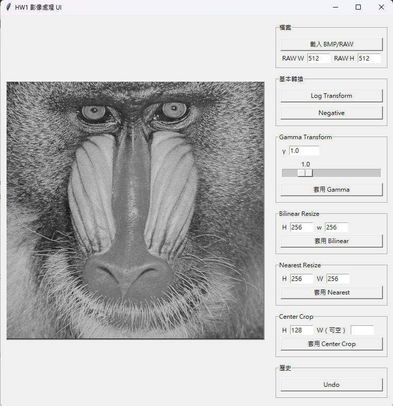

# Multi-Modality Image Processing, Home Work

多模態影像資料處理的作業都會集中在這裡!

## HW1
center crop, log-transform, gamma-transform, image negative, bilinear interpolation and nearest-neighbor interpolation.
### Everything in EXE!

點開GUI.exe就可以開始使用了! 一開始請先載入圖片，**RAW檔請先設好大小再進行載入**。  
每一次的更動都會在左邊的視窗顯示，歷史的更動最多只會保存五次，若更動超過五次想回到原圖請重新載入。

### Also work in single file!
為重現每個報告中的結果，直接執行ToolBox.py可以直接載入data(預設)資料夾內所有BMP和RAW影像，並且將每一個步驟的結果都儲存至result資料夾裡的影像檔案相對名稱的資料夾中。  
  
folder_path: 設定所有影像檔案的讀取位置  
crop_folder_path: 設定做center crop後要儲存的資料夾名稱  
ehz_folder_path: 設定做image enhancement後要儲存的資料夾名稱  
resize_folder_path: 設定做interpolation resize後要儲存的資料夾名稱  

    python ToolBox.py --folder_path './data' --crop_folder_path 'crop' --ehz_folder_path 'enhance' --resize_folder_path 'resize'